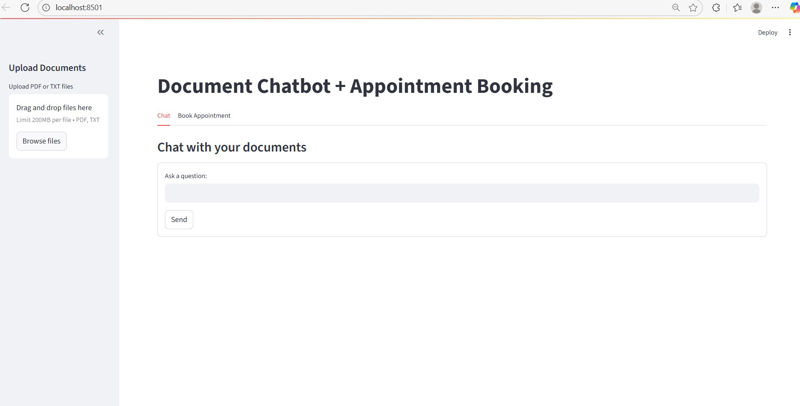
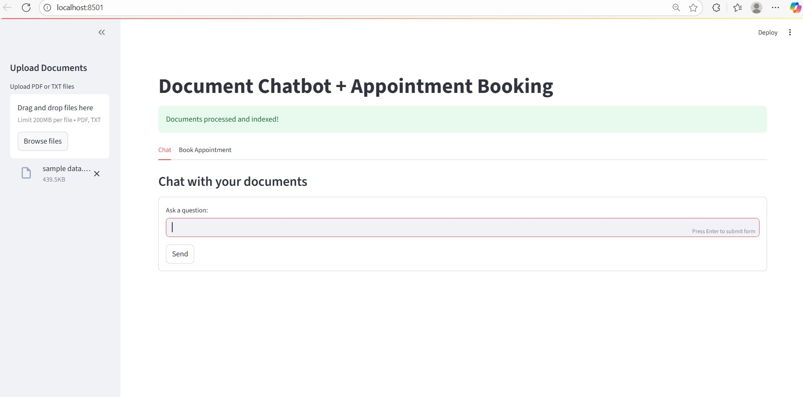
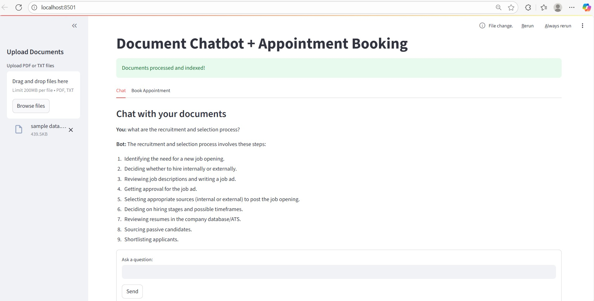
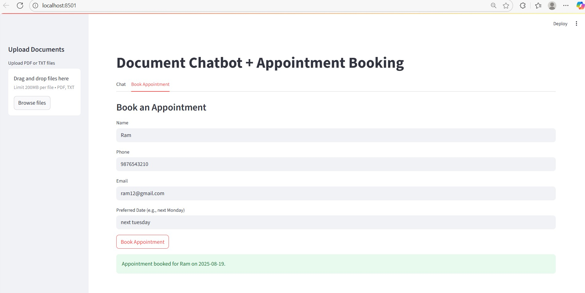

# Document RAG Assistant with Appointment Booking






## About this project

This was one of the projects I built a few months ago while I was learning AI/ML and getting used to the tools people use to build LLM apps. At that point I'd only ever called an LLM API and printed whatever it sent back, and I wanted to know what it actually takes to make an app work with your own data - how a document turns into something searchable, how the right piece of it gets pulled out for a question, and how that gets handed to the model before it answers.

So this app does two things: you upload a PDF or TXT and ask questions about it (a basic RAG setup), and there is a second tab where you can book an appointment through a simple form. It's not meant to be a real booking product, it was mainly a way to practice putting these pieces together myself.

## Project overview

Uploading a document saves it, extracts the text, splits it into chunks, and stores embeddings of those chunks in a local Chroma database. When you ask something in the Chat tab, the app searches Chroma for the chunks closest to your question and gives those to Gemini as context so it answers from your document instead of guessing.

The booking tab is separate from that. It's a plain form for name, phone, email, and a date - the date field accepts things like "next Monday" or "in two weeks" and gets converted to `YYYY-MM-DD` with `dateutil`. Once the required fields are filled in and pass validation, the booking gets written to a local `.jsonl` file.

## Why RAG

The short version: asking an LLM a question directly only uses what it already knows.

```
Question -> LLM -> Answer
```

That's fine for general knowledge, but it has no idea what's inside a file you just uploaded. RAG adds a step before that - search your own data first, then hand the relevant part to the model.

```
Question -> search your documents -> relevant chunks -> LLM -> Answer
```

That's basically the whole idea this project is built around.

## How the document pipeline works

A PDF or TXT file gets uploaded through the sidebar and saved into `docs/`. Text is pulled out with `PyPDFLoader` for PDFs (which uses `pypdf` under the hood) or `TextLoader` for plain text.

That text then gets split into chunks - about 1200 characters each with 150 characters of overlap, using LangChain's `RecursiveCharacterTextSplitter`, so the app isn't stuck retrieving whole documents when only one paragraph is relevant.

Each chunk gets turned into a vector using Gemini's embedding model. The numbers themselves don't mean anything on their own, but chunks about similar things end up closer together in that space, which is what makes it possible to search by meaning instead of exact keywords.

Those vectors go into Chroma, running locally and saved to `storage/chroma/`. When a question comes in, it gets embedded the same way and Chroma returns the closest chunks. Those chunks plus the original question get put into a prompt and sent to `gemini-1.5-flash`, which writes the answer.

So: Chroma finds the relevant text, Gemini writes the answer. Two separate jobs.

## The booking side

This part is a lot simpler than the RAG side, and that was kind of the point - not everything needs to go through an LLM.

The form checks that all four fields (name, phone, email, date) are filled in. The email box just checks for `@` and `.` before you can submit, and once it reaches the backend `tools_booking.py` runs a proper regex check before it actually saves anything. Phone is checked to be digits only, 7 to 15 of them.

The date is the one part that leans on something smarter than a plain rule - `dateutil.parser` reads whatever you typed ("next Monday", "tomorrow") and turns it into an actual date. If it can't figure it out, the booking gets rejected.

`agent.py` is what decides whether an incoming message is a booking request or a document question - it just checks if the message contains a phrase like "book appointment" or "schedule a call". It's not really an agent deciding anything on its own, it's a keyword check, and the file name is a bit generous for what it does. I kept the name anyway since it's honestly what I was going for at the time, even if I hadn't built real tool-calling yet.

## Technologies used

- **Python** - ties everything together
- **Streamlit** - the whole UI: upload, tabs, chat, forms
- **LangChain** - document loading, chunking, and the Chroma connector
- **Google Gemini** - embeddings (`models/embedding-001`) and answers (`gemini-1.5-flash`)
- **Chroma** - local vector store
- **pypdf** (via `PyPDFLoader`) - pulls text out of PDFs
- **python-dateutil** - turns "next Monday" into a real date

## Project structure

```
Documents-chatbot-Booking-appointment/
├── app.py
├── requirements.txt
├── README.md
├── backend/
│   ├── llm_setup.py       Gemini client + embeddings wrapper
│   ├── ingest.py          loads, chunks, embeds documents into Chroma
│   ├── rag_chain.py       retrieves context and asks Gemini
│   ├── tools_booking.py   email/phone validation, date parsing
│   └── agent.py           routes a message to booking or to RAG
├── docs/                  sample doc, uploaded files land here too
├── storage/               chroma db + appointments.jsonl (created at runtime)
└── images/
```

## Running it

Clone it and install the dependencies:

```bash
git clone https://github.com/sabnam813/Documents-chatbot-Booking-appointment.git
cd Documents-chatbot-Booking-appointment
pip install -r requirements.txt
```

Get a Gemini API key from Google AI Studio and set it as an environment variable:

```bash
export GEMINI_API_KEY="your_api_key_here"
```

(on Windows: `setx GEMINI_API_KEY "your_api_key_here"`, then restart the terminal)

Then run:

```bash
streamlit run app.py
```

Upload a document from the sidebar, ask it something in the Chat tab, or go fill in the Book Appointment tab.

## What building this actually taught me

Mostly it made RAG click in a way that reading about it never did - actually watching a document get chunked, embedded, and pulled back out for a question made the whole idea concrete instead of abstract. Same with embeddings: I understood the theory before, but seeing similar chunks actually get retrieved for a question is different from just knowing the definition.

I also came out of it with a better sense of where an LLM should and shouldn't be involved. The booking form doesn't touch Gemini at all - it's regular validation and a date-parsing library - and that felt like a useful thing to notice early on, that a lot of an "AI app" is honestly just normal application code around a fairly small model-calling part.

## What's rough about it

Being honest about this since it was a learning project and not something built for real use:

- No login or auth at all
- The booking "router" is just keyword matching, so it'll miss anything phrased differently than the trigger list
- Appointments are stored in a flat file with nothing stopping duplicates or conflicts
- No document citations - the answer doesn't say which chunk it came from
- No tests

## Possible next steps

- Replace the keyword check in `agent.py` with actual function-calling
- Store appointments in a real database instead of a `.jsonl` file
- Add conflict checking and maybe calendar sync
- Add source citations to chatbot answers
- Write some tests for the validators at least

## License

MIT.
